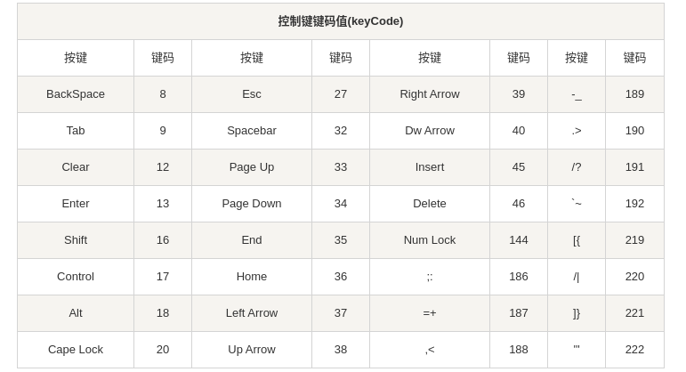

## C/C++ 获取键盘事件

Windows 系统下的 vs 中可以使用 _kbhit() 函数来获取键盘事件，使用时需要加入 conio.h 头文件，例：

```c++
#include <conio.h>
#include <iostream>
 
using namespace std;
 
int main()
{
    int ch;
    while (1){
        if (_kbhit()){               //如果有按键按下，则_kbhit()函数返回真
            ch = _getch();          //使用_getch()函数获取按下的键值
            cout << ch;
            if (ch == 27){ break; }//当按下ESC时循环，ESC键的键值时27.
        }
    }
    system("pause");
}
```

在 Unix/Linux 下，并没有提供 kbhit() 函数。我们可以自己来实现 kbhit() 程序。


```c++

#include <ros/ros.h>
#include <sensor_msgs/PointCloud.h>
#include <iostream>
#include <termios.h>

int scanKeyboard()
{
    int in;
    struct termios new_settings;
    struct termios stored_settings;
    tcgetattr(0,&stored_settings);
    new_settings = stored_settings;
    new_settings.c_lflag &= (~ICANON);
    new_settings.c_cc[VTIME] = 0;
    tcgetattr(0,&stored_settings);
    new_settings.c_cc[VMIN] = 1;
    tcsetattr(0,TCSANOW,&new_settings);

    in = getchar();

    tcsetattr(0,TCSANOW,&stored_settings);
    return in;
}

int main(int argc,char** argv){
    ros::init(argc, argv, "transform128");
    ros::NodeHandle n;
    mcloud = new pointCloud; //点云对象初始化
    ros::Subscriber m_sub = n.subscribe("ruby128", 1, transcloud); //订阅cloud节点
    ros::Publisher m_pub = n.advertise<sensor_msgs::PointCloud>("ruby128_trans", 1); //消息发布者
    pub = &m_pub;
    ros::Rate loop_rate(10);
    while (ros::ok()) {
    	switch (scanKeyboard()) {
               case 49:
                NumNow = 1;
                m_trans.xRadian += 0.0001;
                printf(" xRadian: %f \n", m_trans.xRadian);
                break;
                }
        ros::spinOnce();
        loop_rate.sleep();
    }
```




