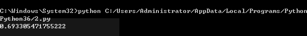
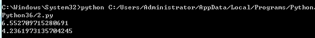
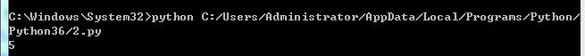
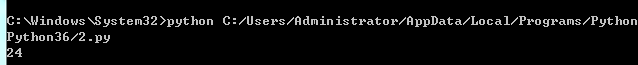
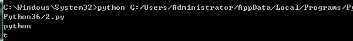
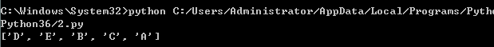
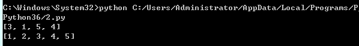

python学习笔记

[TOC]

# 主要模块

## argparse模块

```python
import argparse
```

argparse是一个Python模块：命令行选项、参数和子命令解析器。

argparse模块可以轻松编写用户友好的命令行接口，程序定义它需要的参数，然后argparse将弄清如何从sys.argv解析出那些参数。argparse模块还会自动生成帮助和使用手册，并在用户给程序传入无效参数时报出错误信息

argparse简单使用流程

主要有三个步骤：

- 创建 `ArgumentParser()` 对象
- 调用 `add_argument()` 方法添加参数
- 使用 `parse_args()` 解析添加的参数

1）创建解析器对象

```python
parser = argparse.ArgumentParser()
```

一般这样即可，全部可选参数如下。

```python
class argparse.ArgumentParser(prog=None, usage=None, description=None, epilog=None, parents=[], formatter_class=argparse.HelpFormatter, prefix_chars='-', fromfile_prefix_chars=None, argument_default=None, conflict_handler='error', add_help=True, allow_abbrev=True)
```

详细解释参考官方文档：https://docs.python.org/zh-cn/3/library/argparse.html#argparse.ArgumentParser

2）添加参数

分为添加**位置参数**-positional arguments和**可选参数**-optional arguments
添加位置参数声明的参数名前缀不带-或--，按照顺序进行解析，在命令中必须出现，否则报错，命令通常为：

```python
parser.add_argument("a")
parser.add_argument("b")
parser.add_argument("c")
```

添加可选参数声明的参数名前缀带-或--,前缀是-的为短参数，前缀是--是长参数，两者可以都有，也可以只有一个,短参数和长参数效果一样。可选参数的值接在位置参数的后面，不影响位置参数的解析顺序。
以深度学习训练中经常出现的为例：

```python
parser.add_argument('--batch-size', type=int, default=64, metavar='N',
                        help='input batch size for training (default: 64)')
parser.add_argument('--momentum', type=float, default=0.5, metavar='M',
                        help='SGD momentum (default: 0.5)')
parser.add_argument('--no-cuda', action='store_true', default=False,
                        help='disables CUDA training')
parser.add_argument('--save-model', action='store_true', default=False,
                        help='For Saving the current Model')
```

其中action参数的'store_true'指的是：触发action时为真，不触发则为假。即储存了一个bool变量，默认为false，触发不用赋值即变为true
type:指定参数类别，默认是str，传入数字要定义
help：是一些提示信息
default：是默认值
metavar: 在 usage 说明中的参数名称，对于必选参数默认就是参数名称，对于可选参数默认是全大写的参数名称.
其它详细用法文档介绍：https://docs.python.org/zh-cn/3/library/argparse.html#argparse.ArgumentParser.add_argument

3）解析参数

```python
args = parser.parse_args()
```

这样args就有了参数属性，可以用args了。

示例：

```python
# 导入包
import argparse 
# 创建解析器
parser = argparse.ArgumentParser() 

#添加位置参数(positional arguments)
parser.add_argument('-a', type=int，help='input a int')
args = parser.parse_args()
print(args.a)
```

示例

计算一个数的平方

```Python
import argparse

parser = argparse.ArgumentParser()
parser.add_argument("square", help="display a square of a given number", type=int)
args = parser.parse_args()
print(args.square**2)
```

将上面的代码保存为文件 argparse_usage.py，在终端运行，结果如下：

```Python
$ python argparse_usage.py 9
81
```


## importlib 模块

```Python
import importlib
```

### importlib.import_module

- 示例

文件结构

```
├── clazz
│   ├── __init__.py
│   ├── a.py
│   └── b.py
└── main.py
```

a.py的代码

```Python
def show():
    print("show A")
```

b.py的代码

```python
def show():
    print("show A")
```

从main中导入clazz包中的a和b模块

main.py

```Python
import importlib

# 绝对导入
a = importlib.import_module("clazz.a")
a.show()
# show A

# 相对导入
b = importlib.import_module(".b", "clazz")
b.show()
# show B
```


## OS模块

```Python
import os
```

### os.path

此时sys.path 返回的是一个列表！

#### os.path.dirname(__file__)

返回脚本的路径，但是需要注意一下几点:

1、必须是实际存在的.py文件，如果在命令行执行，则会引发异常NameError: name '__file__' is not defined

2、在运行的时候如果输入完整的执行的路径，则返回.py文件的全路径如：

`python c:/test/test.py` 则返回路径 c:/test ；如果是`python test.py` 则返回空

3、结合os.path.abspath用

```Python
os.path.dirname(os.path.abspath(__file__))
```

`os.path.abspath(__file__)`返回的是.py文件的绝对路径

#### os.path.append(path)

使用sys.path.append()方法可以临时添加搜索路径，方便更简洁的import其他包和模块。这种方法导入的路径会在python程序退出后失效。

#### os.path.join()

连接两个或更多的路径名组件

1.如果各组件名首字母不包含’/’，则函数会自动加上

2.如果有一个组件是一个绝对路径，则在它之前的所有组件均会被舍弃

3.如果最后一个组件为空，则生成的路径以一个’/’分隔符结尾

- 示例

```Python
import os

Path1 = 'home'
Path2 = '/develop'
Parth3 = 'develop'
Path4= 'code'

Path10 = Path1 + Path2 + Path4
Path20 = os.path.join(Path1,Path2,Path4)
Path30 = os.path.join(Path1,Path3,Path4)
print ('Path10 = ',Path10)
print ('Path20 = ',Path20)
print ('Path30 = ',Path30)
```

```Python
output:

Path10 = home/developcode
Path20 = /develop/code
Path30 = home/develop/code
```

#### os.path.exists(path), os.mkdir(path)

判断路径是否存在，一般配合os.makedirs(path)使用

```Python
if not os.path.exists(path)
	os.makedirs(path)
```

### os.system('string')

system函数可以将字符串转化成命令在服务器上运行；其原理是每一条system函数执行时，其会创建一个子进程在系统上执行命令行，子进程的执行结果无法影响主进程；

```Python
import os`
os.system('cd /usr/local')
os.mkdir('aaa.txt)
```

上述程序运行后会发现txt文件并没有创建在/usr/local文件夹下，而是在当前的目录下。

使用system执行多条命令

```Python
import os
os.system('cd /usr/local && mkdir aaa.txt')
# 或者 
#os.system('cd /usr/local ; mkdir aaa.txt')
```

- 示例

```Python
os.system('cp %s %s' % (MODEL_FILE, LOG_DIR))
```

### os.listdir(<string> path)

os.listdir()方法用于返回指定的文件夹包含的**文件或文件夹名字的列表**

它不包括`.`和`..`，即使它在文件夹中


## PIL模块

简介：python image library

### PIL.Image

```python
from PIL import Image
```

python中简单的图像处理函数

```python
img = Image.open("d:/dog.png") # 打开图像
img.show() # 显示图像
```

但是，推荐使用matplotlib来进行显示图像的操作

```python
from PIL import Image
import matplotlib.pyplot as plt
img = Image.open("d:/dog.png") 
plt.figure("dog")
plt.imshow(img)
plt.show()

# figure是默认自带axis的，如果没有需要，可以关掉
plt.axis('off')
```

 打开图片后，可以使用一些属性来查看图片信息，如

```python
print(img.size) # 图片的尺寸  (512,512)
print(img.mode) # 图片的模式  RGBA
print(img.format) # 图片的格式 PNG 
```

图片的保存

```python
img.save('d:/dog.jpg') # 保存为jpg
```


#### image.crop()

使用Image.crop()方法对图片进行切割。

参数：

```
Image.crop(left, up, right, below)
```

left：与左边界的距离

up：与上边界的距离

right：还是与左边界的距离

below：还是与上边界的距离

简而言之就是，左上右下。

例子：将一张美女图片切分成9张（3*3）

图片：


 

代码：

```python
# -*- coding: utf-8 -*-

from PIL import Image

filename = r'路径\美女.jpg'
img = Image.open(filename)
size = img.size
print(size)

# 准备将图片切割成9张小图片
weight = int(size[0] // 3)
height = int(size[1] // 3)
# 切割后的小图的宽度和高度
print(weight, height)

for j in range(3):
    for i in range(3):
        box = (weight * i, height * j, weight * (i + 1), height * (j + 1))
        region = img.crop(box)
        region.save('{}{}.png'.format(j, i))
```

切割出来的图片：


## random 模块

1.random.random()

用于生成一个0到1的随机浮点数： 0<= n <= 1.0

```python
 import random  
 a = random.random()
 print (a)  
```




2.random.uniform(a,b) 

用于生成一个指定范围内的随机符点数，两个参数其中一个是上限，一个是下限。如果a > b，则生成的随机数n: b <= n <= a。如果 a <b， 则 a <= n <= b。

```python
1 import random  
2 print(random.uniform(1,10))  
3 print(random.uniform(10,1)) 
```

 

 

3.random.randint(a, b)

 \#用于生成一个指定范围内的整数。其中参数a是下限，参数b是上限，生成的随机数n: a <= n <= b

```python
1 import random  
2 print(random.randint(1,10))  
```




4.random.randrange([start], stop [, step])

 \#从指定范围内，按指定基数递增的集合中 获取一个随机数。

random.randrange(10, 30, 2)，结果相当于从[10, 12, 14, 16, ... 26, 28]序列中获取一个随机数。

random.randrange(10, 30, 2)在结果上与 random.choice(range(10, 30, 2) 等效。

```python
1 import random  
2 print(random.randrange(10,30,2)) 
```



 

5.random.choice(sequence)

\#random.choice从序列中获取一个随机元素。其函数原型为：random.choice(sequence)。

参数sequence表示一个有序类型。这里要说明 一下：sequence在python不是一种特定的类型，而是泛指一系列的类型。list, tuple, 字符串都属于sequence。

```python
1 import random  
2 lst = ['python','C','C++','javascript']  
3 str1 = ('I love python')  
4 print(random.choice(lst))
5 print(random.choice(str1))  
```



 

6.random.shuffle(x[, random])

\#用于将一个列表中的元素打乱,即将列表内的元素随机排列。

```python
1 import random
2 p = ['A' , 'B', 'C', 'D', 'E' ]
3 random.shuffle(p)  
4 print (p)  
```




7.random.sample(sequence, k)

\#从指定序列中随机获取指定长度的片断并随机排列。注意：sample函数不会修改原有序列。

```python
1 import random   
2 lst = [1,2,3,4,5]  
3 print(random.sample(lst,4))  
4 print(lst) 
```




------

## torchvision模块

torchvision 由3个子包组成，分别是torchvision.datasets 、 torchvision.models 、 torchvision.transforms

#### **torchvision.transforms**

```python
from torchvision import transform as T 
```

这个包里面包含resize、crop等常见的data augmentation操作，基本上pytorch 中的data augumentation操作都可以通过改接口实现

##### **Resize()**

· 如果输入的为单个`int`值，则将输入图像的短边resize到这个int数，长边根据对应比例调整，图像长宽比保持不变

· 如果输入为（h, w)，且h, w为int，则直接将输入图像resize到（h, w）尺寸，图像长宽比可能会发生改变

```python
T.resize((512,512)) #重新裁切大小

T.RandomRotation((angel_1,angel_2)) #随机旋转的角度，从angel_1到angel_2
```

##### **CenterCrop()**

已输入图像img的中心作为中心点进行指定size的crop操作，在数据增强中一般不会去使用该方法，因为当size固定时，对于同一张img，N次centercrop的结果是一样的

size可以是单个`int`值，也可以给`(int(size), int(size))`

##### **RandomCrop()**

RandomCrop相比于前面的CenterCrop要更加常用一些，两者的区别在于RandomCrop的中心点坐标是随机的，不再是输入图像的中心坐标，因此基本上每次crop生成的图像都是不同的

##### **RandomHorizontalFlip()**

图像随机水平翻转，翻转概率为0.5

##### **RandomVerticalFlip()**

图像随机垂直翻转

##### **RandomResizedCrop()**

`CenterCrop`和`RandomCrop`在Crop时是固定size，`RandomResizedCrop`则是随机size的crop

##### ColorJitter()

改变图像的属性：亮度（brightness）、对比度（contrast）、饱和度（saturation）和色调（hue）

示例：

```python
color_aug = transform.ColorJitter(brightness = 0.5, contrast = 0.5, saturation = 0.5, hue = 0.5)
```

```python
#单独设置
brightness_change = transform.ColorJitter(brightness = 0.5)
contrast_change = transform.ColorJitter(brightness = 0.5)
hue_change = transform.ColorJitter(brightness = 0.5)

transform = transforms.Compose([brightness_change，contrast_change，hue_change])
```


# 学习python

##  python中的[:-1]和[::-1]

1、案例解释

```python
a='python'

b=a[::-1]
print(b)  # nohtyp

c=a[::-2]
print(c) # nhy

#从后往前数的话，最后一个位置为-1

d=a[:-1]  #从位置0到位置-1之前的数
print(d)  #pytho

e=a[:-2]  #从位置0到位置-2之前的数
print(e)  #pyth
```

2、用法说明

b = a[i:j]  表示复制a[i]到a[j-1]，以生成新的list对象

a = [0,1,2,3,4,5,6,7,8,9]
b = a[1:3]   # [1,2]
当i缺省时，默认为0，即 a[:3]相当于 a[0:3]
当j缺省时，默认为len(alist), 即a[1:]相当于a[1:10]
当i,j都缺省时，a[:]就相当于完整复制一份a

b = a[i:j:s]表示：i,j与上面的一样，但s表示步进，缺省为1.
所以a[i:j:1]相当于a[i:j]
当s<0时，i缺省时，默认为-1. j缺省时，默认为-len(a)-1
所以a[::-1]相当于 a[-1:-len(a)-1:-1]，也就是从最后一个元素到第一个元素复制一遍，即倒序。


------

## 元组和列表

```python
a = [] #这是一个列表
b = () #这是一个元组
```

区别： 列表可以修改而元组不可以修改，例如可以往列表中用append()添加元素。

相同点： 列表和元组都是容器，包含了一些列的对象，二者都可以包含任意类型的元素甚至包含序列

## python map()函数和lambda表达式

python map(fun，[arg]+)函数最少有两个参数，第一参数为一个函数名，第二个参数是对应的这个函数的参数（一般为一个或多个list）。

```python
>>>def fun(x):
...     return x+1
...
>>>list(map(fun,[1,2,3]))
>>>[2,3,4]
```

多参数例子：

```python
>>>def fun(x,y,z):
...     return x*y*z
...
>>>list(map(fun,[1,2,3],[1,2,3],[1,2,3]))
>>>[1,8,27]
```

(python 3.x 中map函数返回的是iterators，无法像python2.x 直接返回一个list，故需要再加上一个list()将iterators转化为一个list)。

lambda表达式：有人说类似于一种匿名函数，通常是在需要一个函数，但是又不想费神去命名一个函数的场合下使用。

```python
>>>s = [1,2,3]
>>>list(map(lambda x:x+1,s))
>>>[2,3,4]
```

这里的 lambda x:x+1 相当于 上面的fun()函数, lambda和（冒号）: 之间相当于 fun()函数的参数, :(冒号)之后 x+1 相当于fun()函数的return x+1

```python
>>>s = [1,2,3]
>>>list(map(lambda x,y,z:x*y*z ,s,s,s))
>>>[1,8,27]
```


------

## open()函数

python open() 函数用于打开一个文件，创建一个 **file** 对象

`open(name[, mode[, buffering]])`

name : 一个包含了你要访问的文件名称的字符串值。

mode : mode 决定了打开文件的模式：只读，写入，追加等。所有可取值见如下的完全列表。这个参数是非强制的，默认文件访问模式为只读(r)。

buffering : 如果 buffering 的值被设为 0，就不会有寄存。如果 buffering 的值取 1，访问文件时会寄存行。如果将 buffering 的值设为大于 1 的整数，表明了这就是的寄存区的缓冲大小。如果取负值，寄存区的缓冲大小则为系统默认。

不同模式打开文件的完全列表：

| 模式 | 描述                                                         |
| ---- | ------------------------------------------------------------ |
| r    | 以只读方式打开文件。文件的指针将会放在文件的开头。这是默认模式。 |
| rb   | 以二进制格式打开一个文件用于只读。文件指针将会放在文件的开头。这是默认模式。 |
| r+   | 打开一个文件用于读写。文件指针将会放在文件的开头。           |
| rb+  | 以二进制格式打开一个文件用于读写。文件指针将会放在文件的开头。 |
| w    | 打开一个文件只用于写入。如果该文件已存在则打开文件，并从开头开始编辑，即原有内容会被删除。如果该文件不存在，创建新文件。 |
| wb   | 以二进制格式打开一个文件只用于写入。如果该文件已存在则打开文件，并从开头开始编辑，即原有内容会被删除。如果该文件不存在，创建新文件。 |
| w+   | 打开一个文件用于读写。如果该文件已存在则打开文件，并从开头开始编辑，即原有内容会被删除。如果该文件不存在，创建新文件。 |
| wb+  | 以二进制格式打开一个文件用于读写。如果该文件已存在则打开文件，并从开头开始编辑，即原有内容会被删除。如果该文件不存在，创建新文件。 |
|a|打开一个文件用于追加。如果该文件已存在，文件指针将会放在文件的结尾。也就是说，新的内容将会被写入到已有内容之后。如果该文件不存在，创建新文件进行写入。|
|ab|以二进制格式打开一个文件用于追加。如果该文件已存在，文件指针将会放在文件的结尾。也就是说，新的内容将会被写入到已有内容之后。如果该文件不存在，创建新文件进行写入。|
|a+|打开一个文件用于读写。如果该文件已存在，文件指针将会放在文件的结尾。文件打开时会是追加模式。如果该文件不存在，创建新文件用于读写。|
|ab+|以二进制格式打开一个文件用于追加。如果该文件已存在，文件指针将会放在文件的结尾。如果该文件不存在，创建新文件用于读写。|

### file对象方法

**file.read([size])**：size 未指定则返回整个文件，如果文件大小 >2 倍内存则有问题，f.read()读到文件尾时返回""(空字串)。

**file.readline()**：返回一行。

**file.readlines([size])** ：返回包含size行的列表, size 未指定则返回全部行。

**for line in f: print line** ：通过迭代器访问。

**f.write("hello\n")**：如果要写入字符串以外的数据,先将他转换为字符串。

**f.tell()**：返回一个整数,表示当前文件指针的位置(就是到文件头的字节数)。

**f.seek(偏移量,[起始位置])**：用来移动文件指针。

​	偏移量: 单位为字节，可正可负

​	起始位置: 0 - 文件头, 默认值; 1 - 当前位置; 2 - 文件尾

**f.close()** 关闭文件


# tensorflow模块

以下简称为tf

### tf.placeholder()

**原型 tf.placeholder(dtype, shape=None, name=None)**

1. dtype：数据类型。常用的是tf.float32,tf.float64等数值类型
2. shape：数据形状。默认是None，就是一维值，也可以是多维（比如[2,3], [None, 3]表示列是3，行不定）
3. name：名称

#### 为什么要用placeholder？

​    Tensorflow的设计理念称之为计算流图，在编写程序时，首先构筑整个系统的graph，代码并不会直接生效，这一点和python的其他数值计算库（如Numpy等）不同，graph为静态的，类似于docker中的镜像。然后，在实际的运行时，启动一个session，程序才会真正的运行。这样做的好处就是：避免反复地切换底层程序实际运行的上下文，tensorflow帮你优化整个系统的代码。我们知道，很多python程序的底层为C语言或者其他语言，执行一行脚本，就要切换一次，是有成本的，tensorflow通过计算流图的方式，帮你优化整个session需要执行的代码，还是很有优势的。

​    所以placeholder()函数是在神经网络构建graph的时候在模型中的占位，此时并没有把要输入的数据传入模型，它只会分配必要的内存。等建立session，在会话中，运行模型的时候通过feed_dict()函数向占位符喂入数据。

- **示例**

  `import tensorflow as tf`
  `import numpy as np`

  `x = tf.placeholder(tf.float32, shape=(1024, 1024))`
  `y = tf.matmul(x, x)`

  `with tf.Session() as sess:`
      `#print(sess.run(y))  # ERROR:此处x还没有赋值`
      `rand_array = np.random.rand(1024, 1024)`
      `print(sess.run(y, feed_dict={x: rand_array})`) 

### tf.train()

#### tf.train.exponential_decay()

在Tensorflow中，为解决设定学习率(learning rate)问题，提供了指数衰减法来解决。

通过tf.train.exponential_decay函数实现指数衰减学习率。

**原型 tf.train.exponential_decay(learning_rate, global_steps, decay_steps, decay_rate, staircase=True/False)**

`decayed_learning_rate = learning_rate * decay_rate ^ (global_step / decay_steps)`

### tf.matmul()

torch.matmul是tensor的乘法，输入可以是高维的。
当输入是都是二维时，就是普通的矩阵乘法，和tensor.mm函数用法相同

当输入有多维时，把多出的一维作为batch提出来，其他部分做矩阵乘法。