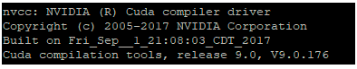
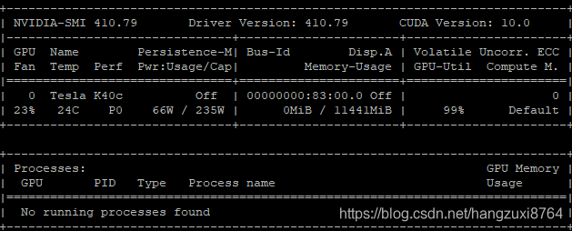
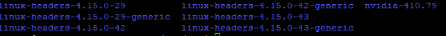

**ubuntu16.04 学习笔记**

[TOC]


# 文件操作类

------

## 查看文件权限

ls -ld 文件夹 (查看文件夹权限)

ls -l 文件夹（查看文件夹子目录的权限）

------

## 给文件权限

sudo chmod 600 ***(只有所有者有读和写的权限)

sudo chmod 644 ***(所有者有读和写的权限，组用户只有读的权限)

sudo chmod 700 ***(只有所有者有读和写以及执行的权限)

sudo chmod 666 ***(每个人都有读和写的权限)

sudo chmod 777 ***(只有所有者有读和写以及执行的权限)

其中*指文件名（也可以是文件夹名，不过要在chmod后面加-R） sudo chmod -R 777 *

解释一下，其实整个命令形式就是：sudo chmod -(代表类型) xxx(所有者) xxx(组用户)xxx(其他用户)

三位数的每一位都表示一个用户类型的权限设置。取值是0~7，即二进制的[000]~[111]

0[000] 无任何权限

4[010]只读权限

6[110]读写权限

7[111]读写执行权限

------

## 查看Linux架构

`uname -a`

这个不是最直观的，但也是一个不错的命令


aarch64就是ARM架构；X84_64就是x64架构；mips就是MIP架构。

`arch`

这个命令也行

------

# 安装操作类

------

## 解压文件

1）*.tar文件

`tar -xvf file.tar`

2) *.tar.gz或者 .tgz文件

`tar -xvzf file.tar.gz`

3) .rar文件

`unrar e file.rar`

4) .zip文件

`unzip file.zip`

------

## 安装文件

1）deb文件

`dpkg -i file`

2)


### Wireshark抓包工具的安装

```
1、安装
sudo apt-get install wireshark
2、执行
sudo wireshark
```

在ubuntu上安装wireshark之后提示Couldn't run /usr/bin/dumpcap in child process:权限不够

```
sudo apt-get install libcap2-bin wireshark
sudo chgrp xxxxxxx /usr/bin/dumpcap
sudo chmod 750 /usr/bin/dumpcap
sudo setcap cap_net_raw,cap_net_admin+eip /usr/bin/dumpcap
3、使用
tcp dst port 433:显示目的TCP端口为443的封包
ip src host 192.168.0.1:显示来源IP地址为192.168.0.1的封包
host 192.168.0.1:显示目的或来源IP地址为192.168.0.1的封包
src portrange:1000-2000:显示来源为TCP或UDP，且端口为1000-2000范围内的封包
not icmp:显示除了icmp以外的所有封包
```

------


## 镜像安装

临时使用

`-i 源网址`

清华源：https://pypi.tuna.tsinghua.edu.cn/simple

永久使用

Linux下，修改 ~/.pip/pip.conf (没有就创建一个)， 修改 index-url至tuna，内容如下：

 [global] 

index-url = https://pypi.tuna.tsinghua.edu.cn/simple

------

# 故障排查类

无法连接NVIDIA驱动：NVIDIA-SMI has failed because it couldn't communicate with the NVIDIA driver

#### NVIDIA-SMI has failed because it couldn’t communicate with the NVIDIA driver

重启服务器之后就出现连接不上NVIDIA驱动的情况。这个时候tensorflow还是可以运行的，但只是在用cpu跑。安装gpu版的TensorFlow时，也显示已安装。

nvidia-smi

```
NVIDIA-SMI has failed because it couldn't communicate with the NVIDIA driver. Make sure that the latest NVIDIA driver is installed and running.
```

我们在终端输入 nvcc -V 发现驱动也在。



这就很魔性了。。。查找了很多方法之后，发现下面这个最简便，只需要两步，而且还不用重启，哈哈。

step1：sudo apt-get install dkms

step2:  sudo dkms install -m nvidia -v 410.79

再次输入nvidia-smi时，你熟悉的界面就会回来啦。



（虽然使用率显示为99%，但并不影响我们使用）

其中step2 中的410.79是NVIDIA的版本号，当你不知道的时候，进入/usr/src目录中，可以看到里面有nvidia文件夹，后缀就是其版本号

cd /usr/src



OK，到此我们就轻松愉快的解决了这个问题。（Yeah!）

另：怎么查看TensorFlow是gpu版本还是cpu版本

```python
from tensorflow.python.client import device_lib
print(device_lib.list_local_devices())
```


# 查看网络端口进程

netstat -uap

